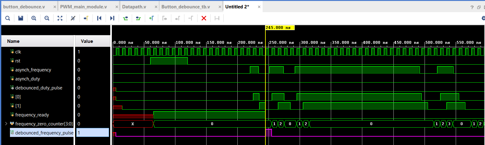
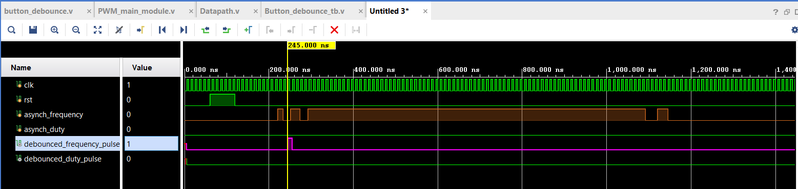
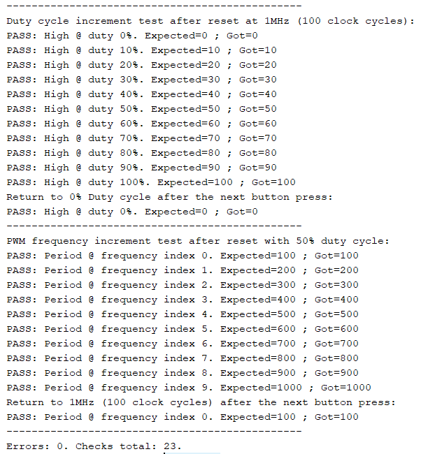

# PWM Generator with Button-Controlled Frequency and Duty Cycle

A Verilog PWM signal generator for a 100 MHz system clock, controlled by two
push buttons. One button steps through 10 output frequencies (1 MHz down to
100 kHz), the other through 11 duty-cycle levels (0 % to 100 % in 10 % steps).
Both buttons pass through a synchroniser and debounce logic, so a single press changes parameter only once.

---

## Design overview

| File | Responsibility |
|---|---|
| `Datapath.v` | Top level. Connects button synchronizer/debouncer with the main PWM signal generator module.|
| `button_debounce.v` | Two independent synchroniser + debounce channels, one per button. |
| `PWM_main_module.v` | Holds the frequency and duty index, converts them into period and high-time values, and generates the waveform. |
| `Datapath_tb.sv` | Self-checking testbench with a reference model for comparison and error detection. |

---

#### TOP module interfaces

| Signal | Width | Description |
|---|---|---|
| `clk` | 1 | Input system clock, 100 MHz (10 ns period) |
| `rst` | 1 | Input synchronous reset, active high |
| `asynch_frequency` | 1 | Input bouncing frequency select button |
| `asynch_duty` | 1 | Input bouncing duty-cycle select button |
| `PWM_signal` | 1 | Output generated PWM waveform |

#### Parameters table

| Parameter | Value | Meaning |
|---|---:|---|
| `SYSTEM_CLK` | 100 000 000 | System clock frequency in Hz |
| `PERIOD_1MHZ` | 100 | SYSTEM_CLK / 1000000 |
| `PERIOD_500KHZ` | 200 | SYSTEM_CLK / 500000 |
| `PERIOD_333KHZ` | 300 | SYSTEM_CLK / 333333 |
| `PERIOD_250KHZ` | 400 | SYSTEM_CLK / 250000 |
| `PERIOD_200KHZ` | 500 | SYSTEM_CLK / 200000 |
| `PERIOD_166KHZ` | 600 | SYSTEM_CLK / 166666 |
| `PERIOD_142KHZ` | 700 | SYSTEM_CLK / 142857 |
| `PERIOD_125KHZ` | 800 | SYSTEM_CLK / 125000 |
| `PERIOD_111KHZ` | 900 | SYSTEM_CLK / 111111 |
| `PERIOD_100KHZ` | 1000 | SYSTEM_CLK / 100000 |

---

#### Frequency selection

`frequency_index` is a 4-bit register with 10 valid states. Every
`debounced_frequency_pulse` increments it; after index 9 the next press wraps it
back to 0, so the button cycles endlessly through the table.

A combinational `case` statement acts as a multiplexer: it maps the index to the
matching period constant `T_PWM` and, at the same time, to `period_tenth`
(the period divided by ten, used for the duty calculation).

| Index | Output frequency | Period `T_PWM` (clock cycles) | `period_tenth` |
|:---:|---|:---:|:---:|
| 0 | 1 MHz | 100 | 10 |
| 1 | 500 kHz | 200 | 20 |
| 2 | 333.33 kHz | 300 | 30 |
| 3 | 250 kHz | 400 | 40 |
| 4 | 200 kHz | 500 | 50 |
| 5 | 166.67 kHz | 600 | 60 |
| 6 | 142.86 kHz | 700 | 70 |
| 7 | 125 kHz | 800 | 80 |
| 8 | 111.11 kHz | 900 | 90 |
| 9 | 100 kHz | 1000 | 100 |

The relationship is `T_PWM = 100 × (frequency_index + 1)`

`duty_index` works the same way but has 11 valid states (0 to 10); after 10 the
next press wraps it back to 0.

---

#### PWM pulse width calculation

The high time is recalculated automatically whenever either index changes:

`period_tenth = T_PWM / 10`
`duty_value   = period_tenth × duty_index`

---

## Debounce mechanism

### Synchronisation

A two-flip-flop synchroniser
(`frequency_synchronizer[1:0]`) resolves metastability due to asynchronious input: the input is sampled into bit 0, and bit 0 into bit 1 one cycle later. The synchroniser output is bit 1. Fixed latency - 20ns;

### Debounce

The debounce logic is edge-triggered with a lockout, not a delay filter. It is
built around a single arming flag:

(`ready = 1`) The first high
sample of the synchronised signal is accepted immediately: the output pulse goes
high for exactly one clock cycle, and `ready` flag is cleared.

(`ready = 0`). The channel ignores the input entirely, and waits
for the contact to settle. The low-sample counter tracks this:

- a high sample resets the counter to 0 — any bounce restarts the wait;
- a low sample increments it;
- once the counter reaches 9, the flag returns to (`ready = 1`).

### Waveforms

**Single button press with contact bounce.** The bouncing input produces exactly
one `debounced_frequency_pulse`, one clock cycle wide.

**Button hold.** The pulse sets HIGH once on the first edge and does not repeat
for the entire duration of the press.

---

## State after reset

`rst` is synchronous and active high. It clears every register in both modules.

It sets frequency index to 0. PWM frequency at 0 index is `PERIOD_1MHZ` (100 clock cycles).

Duty index is set to 0. `active_duty` sets the duty cycle to 0%.

The resulting `PWM_signal` output state is LOW, since `active_duty` is 0.

---

## Running the simulation

1. Create a new RTL project in Vivado.
2. Add as **design sources**: `Datapath.v`, `button_debounce.v`, `PWM_main_module.v`.
3. Add as a **simulation source**: `Datapath_tb.sv`.
4. Set the testbench file type to SystemVerilog. 
5. Set `Datapath_tb` as the simulation top module.
6. **Run Behavioral Simulation**. Expected simulation time - 363880 ns.

### Test 1 — duty-cycle sweep at 1 MHz

The frequency is left at its reset value of 1 MHz and the
duty button is pressed twelve times, walking the duty cycle through every one of
its eleven levels and one step past the end. After each press the testbench
waits 1100 clock cycles for the new parameter to take effect.

### Test 2 — frequency sweep at 50 % duty

After a reset, 5 duty-cycle button presses sets the duty cycle at 50 %. The frequency button is then pressed 10 times, sweeping all ten periods and wrapping back to the start.

---

---

### Test coverage

The testbench checks the reset logic and that the correct initial values are
set, verifies the operation of the debounce mechanism — one button press changes
the parameter exactly once — measures the high pulse duration and the period
duration, and checks the PWM signal generation.

